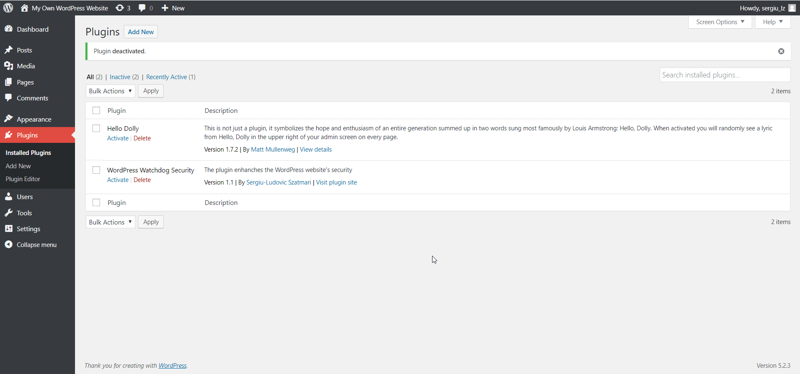

# WordPress Watchdog Security Plugin

WordPress plugin that enhanches the website's security.

<p align="center">

</p>

## Instalation

1. Use Git to download the plugin
    ```
    git clone https://github.com/sergiu-szatmari/wp-watchdog-security
    ```

2. Archive the root folder as _zip_;

3. The _plugin_ can be uploaded to the WordPress website normally, through the administration panel.

## Demo



### Acknowledgments

* User-Agent values lists were made with the help of [_Nginx Ultimate Bad Bot Blocker_](https://github.com/mitchellkrogza/nginx-ultimate-bad-bot-blocker) project's lists;

* The Web Application Firewall component was developed and inspired by Alemalakra's [_xWAF_](https://github.com/Alemalakra/xWAF) project. 

* I don't own the [_Watchdog Readme File Photo_](https://www.gstatic.com/mobilesdk/180227_mobilesdk/storage_rules_zerostate.png).